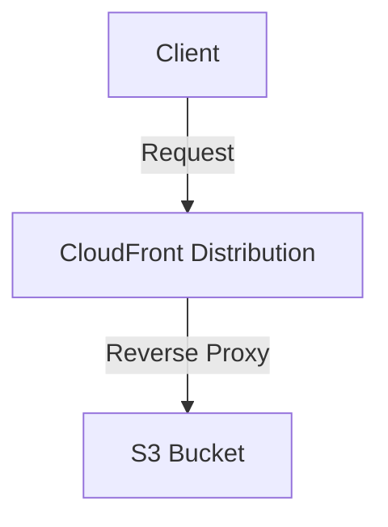

# Terraform Configuration for AWS S3 Bucket and CloudFront Distribution

This Terraform configuration sets up an AWS S3 bucket and a CloudFront distribution for a frontend application.

## Provider

- AWS provider is configured with the region `ap-southeast-2`.

## Architecture

## Resources

1. **S3 Bucket**:

   - Creates an S3 bucket named `frontend-bucket-inff-mark`.
   - Set force destroy to avoid manualy empty bucket needed for executing terraform destroy.
   - Restricts public access by configuring public access block settings.
   - Enables server-side encryption with AES256 for enhanced security.
   - Disables versioning explicitly to simplify storage management.
   - Tags the bucket with `Project = inff` for resource identification.

2. **CloudFront Distribution**:

   - Configures CloudFront to use the S3 bucket as the origin.
   - Sets default cache behavior, viewer protocol policy, allowed methods, and cache policy.
   - Utilizes the default CloudFront certificate to enforce HTTPS communication.
   - Avoids geo-restrictions to ensure global accessibility.
   - Tags the distribution with `Project = inff` for resource identification.

3. **Origin Access Identity (OAI)**:

   - Establishes an OAI to allow secure access to the S3 bucket through the CloudFront distribution.

4. **S3 Bucket Policy**:
   - Attaches a bucket policy to grant CloudFront access to the S3 bucket, ensuring secure and controlled interaction.

## Outputs

1. **cloudfront_url**:

- Outputs the ARN and domain name of the CloudFront distribution.

2. **s3_bucket_deployment_info**:

- Outputs the ARN, bucket name, and region of the S3 bucket.
